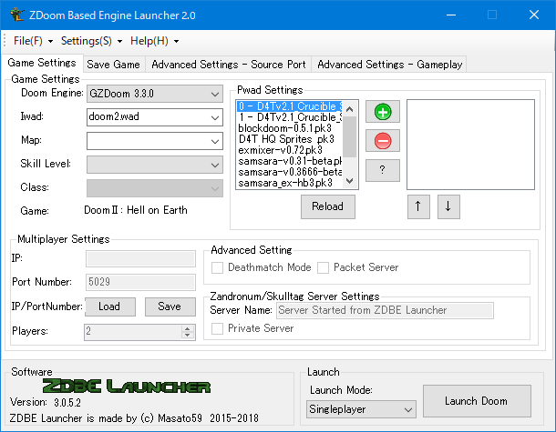

# ZDoom Based Engine Launcher

:computer:[Website](https://sites.google.com/view/zdoom-based-engine-launcher/) - :ledger:[Changelog](https://github.com/masato462/ZDoom-Based-Engine-Launcher/releases) - :floppy_disk:[Download](https://github.com/masato462/ZDoom-Based-Engine-Launcher/releases)

# What is ZDoom Based Engine Launcher (ZDBL)?
Launcher for ZDoom derivative Engines. ZDoom/GZDoom/QZDoom/Skulltag/Zandronum and more. 
Chocolate Doom and some of its derived engines will work. (Not all options are available.)  

This launcher is forever in alpha.  
I will be slowly implementing various features.  

etc...  
For other, please visit [ZDoom Based Engine Launcher's page](https://sites.google.com/view/zdoom-based-engine-launcher/home).  
  
# Features currently under development  
:white_check_mark::rage1:The configuration files can be combined into a single ini file.  
:white_check_mark:Partial support for EDGE  
:white_check_mark:EDGE: Make Window mode, fullscreen mode, and rendering API selection available.  
:white_check_mark:Option to enable dedicated servers to run Chocolate Doom  
:construction:Move the game database to an external file so that you can add game data freely.  
:construction::speech_balloon:You will be able to load language files.   
(You can create your own and load them.)  
:construction:Support for more Chocolate Doom features  
  
:white_check_mark:=Developed :wrench:=Developed and checked for bugs :construction:=under development  
## :heavy_exclamation_mark:Attention:
## Currently the source code of this launcher is not released. The latest version of the launcher can be downloaded from the [Release Page](https://github.com/masato462/ZDoom-Based-Engine-Launcher/releases) at any time.
